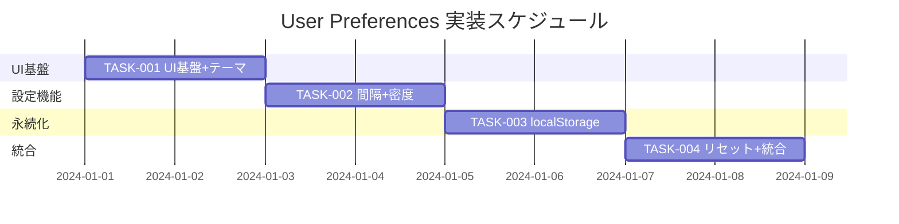

# User Preferences 実装タスク

## 概要

全タスク数: 4
推定作業時間: 8-12時間
クリティカルパス: TASK-001 → TASK-002 → TASK-003 → TASK-004

## タスク一覧

### フェーズ1: UI基盤とテーマ切替

#### TASK-001: ユーザープリファレンス UI基盤 + テーマ切替

- [ ] **タスク完了**
- **タスクタイプ**: TDD
- **要件リンク**: REQ-001 (テーマ切替)
- **依存タスク**: なし
- **実装詳細**:
  - UserPreferences コンポーネントの作成
  - Theme用 `<select>` (light/dark) の実装
  - `<html data-theme>` 属性の即時更新機能
  - 基本的なCSS設定
- **単体テスト要件**:
  - [ ] Theme選択でdata-theme属性が変更される
  - [ ] light/darkの切替が正常に動作する
  - [ ] 初期値がlightに設定される
- **UI/UX要件**:
  - [ ] 設定変更は100ms以内に反映
  - [ ] テーマ変更で色彩が即座に切り替わる
- **完了条件**:
  - [ ] テーマ切替が動作している
  - [ ] 単体テストがパス
  - [ ] ビジュアル確認完了

### フェーズ2: 自動更新間隔と表示密度

#### TASK-002: 自動更新間隔 + 表示密度設定

- [ ] **タスク完了**
- **タスクタイプ**: TDD
- **要件リンク**: REQ-002 (自動更新), REQ-003 (表示密度)
- **依存タスク**: TASK-001
- **実装詳細**:
  - 自動更新間隔 `<select>` (Off/5s/10s/30s) の追加
  - System time更新タイマーの再設定機能
  - 表示密度 `<select>` (compact/standard) の追加
  - `<body>` への CSS class適用機能
- **単体テスト要件**:
  - [ ] Interval選択でタイマー間隔が変更される
  - [ ] Density選択でbodyのCSSクラスが変更される
  - [ ] Off設定でタイマーが停止する
  - [ ] 各設定の初期値が正しい
- **UI/UX要件**:
  - [ ] タイマー変更は即座に反映
  - [ ] 表示密度変更で余白が調整される
- **完了条件**:
  - [ ] 自動更新間隔設定が動作
  - [ ] 表示密度設定が動作
  - [ ] 既存のテーマ設定が正常動作
  - [ ] 単体テストがパス

### フェーズ3: 永続化機能

#### TASK-003: localStorage永続化

- [ ] **タスク完了**
- **タスクタイプ**: TDD
- **要件リンク**: REQ-004 (永続化)
- **依存タスク**: TASK-002
- **実装詳細**:
  - localStorage保存機能の実装
  - ページ読込時の設定復元機能
  - JSON形式での設定管理
  - 設定変更時の自動保存
- **単体テスト要件**:
  - [ ] 設定がlocalStorageに保存される
  - [ ] ページ再読込で設定が復元される
  - [ ] 各設定項目の保存/読込が正常動作
  - [ ] 不正なデータの処理が適切
- **テスト要件**:
  - [ ] localStorage操作のモック
  - [ ] 設定復元のシミュレーション
- **完了条件**:
  - [ ] 全設定の永続化が動作
  - [ ] ページ再読込テスト完了
  - [ ] データ容量が1KB以内
  - [ ] 単体テストがパス

### フェーズ4: リセット機能と統合

#### TASK-004: リセット機能 + 統合テスト

- [ ] **タスク完了**
- **タスクタイプ**: TDD
- **要件リンク**: REQ-005 (リセット)
- **依存タスク**: TASK-003
- **実装詳細**:
  - 「Reset to Default」ボタンの追加
  - 確認ダイアログの実装
  - 全設定を既定値に戻す機能
  - localStorageクリア機能
- **単体テスト要件**:
  - [ ] Resetで全設定が既定値に戻る
  - [ ] localStorageが適切にクリアされる
  - [ ] confirm()ダイアログが表示される
  - [ ] キャンセル時に変更されない
- **統合テスト要件**:
  - [ ] E2Eテスト: 全設定変更 → Reset → 既定値確認
  - [ ] E2Eテスト: 設定変更 → ページ再読込 → 設定復元
  - [ ] E2Eテスト: テーマ/間隔/密度の組み合わせテスト
- **UI/UX要件**:
  - [ ] リセット確認ダイアログ
  - [ ] 既定値への即座復元
- **完了条件**:
  - [ ] リセット機能が完全動作
  - [ ] 全機能の統合テスト完了
  - [ ] 受け入れ条件全項目クリア

## jscpd 重複コードチェック（TDD 連動）

最小の実行手順と出力先を示すこと。必要以上に長くしないこと。

```bash
cd frontend
npm run dup
npm run dup:report  # reports/jscpd/html/index.html
```

補足（短文）:
- `dup` は `src` と `../backend` を対象に実行します
- 閾値・除外パターンは `frontend/package.json` の `dup:*` で調整
  - 実行タイミング（推奨）:
    - `/tdd-green` 完了"直後"に実行（新規実装による重複が出ていないか確認）
    - `/tdd-refactor` "開始前"に実行（現状の重複を基準化）
    - `/tdd-refactor` "完了後"に実行（重複削減の効果を HTML レポートで検証）

## tsumiki カスタムコマンドの使い方（jscpd連動版）

- Green 直後の重複確認まで一括:
  - claude -p "/tdd-green-with-jscpd"
- Refactor 前後の重複計測・評価まで一括:
  - claude -p "/tdd-refactor-with-jscpd"

通常の `/tdd-green` `/tdd-refactor` を使う場合は、上記コマンドの代わりに手動で `cd frontend && npm run dup`（必要なら `dup:report`）を挟んでください。

参考: ESC 追加情報テンプレや詳細な実行設計は `docs/guides/tsumiki-task-execution-design.md` を参照してください。

## Cursor レビュー依頼テンプレート（全タスク共通）

#### TASK-001 /tdd-green 用
```text
TASK-001 に対する /tdd-green の成果物をレビューしてください。

対象:
- 機能: ユーザープリファレンス UI基盤 + テーマ切替の最小実装
- 変更ファイル（例）:
  - frontend/src/UserPreferences.jsx
  - frontend/src/UserPreferences.test.jsx
  - frontend/src/App.css

確認観点:
- 要件の満たし方
- Red → Green の成立（テストの妥当性）
- 命名・責務分割・可読性
```

#### TASK-001 /tdd-refactor 用
```text
TASK-001 に対する /tdd-refactor の成果物をレビューしてください。

対象:
- 重複排除・命名改善・責務整理のリファクタリング

確認観点:
- 動作維持（テストはグリーン）
- 重複削減・見通し・拡張性
```

#### TASK-002 /tdd-green 用
```text
TASK-002 に対する /tdd-green の成果物をレビューしてください。

対象:
- 機能: 自動更新間隔 + 表示密度設定の最小実装
- 変更ファイル（例）:
  - frontend/src/UserPreferences.jsx
  - frontend/src/UserPreferences.test.jsx
  - frontend/src/App.css

確認観点:
- 要件の満たし方
- Red → Green の成立（テストの妥当性）
- 命名・責務分割・可読性
```

#### TASK-002 /tdd-refactor 用
```text
TASK-002 に対する /tdd-refactor の成果物をレビューしてください。

対象:
- 重複排除・命名改善・責務整理のリファクタリング

確認観点:
- 動作維持（テストはグリーン）
- 重複削減・見通し・拡張性
```

#### TASK-003 /tdd-green 用
```text
TASK-003 に対する /tdd-green の成果物をレビューしてください。

対象:
- 機能: localStorage永続化の最小実装
- 変更ファイル（例）:
  - frontend/src/UserPreferences.jsx
  - frontend/src/UserPreferences.test.jsx

確認観点:
- 要件の満たし方
- Red → Green の成立（テストの妥当性）
- 命名・責務分割・可読性
```

#### TASK-003 /tdd-refactor 用
```text
TASK-003 に対する /tdd-refactor の成果物をレビューしてください。

対象:
- 重複排除・命名改善・責務整理のリファクタリング

確認観点:
- 動作維持（テストはグリーン）
- 重複削減・見通し・拡張性
```

#### TASK-004 /tdd-green 用
```text
TASK-004 に対する /tdd-green の成果物をレビューしてください。

対象:
- 機能: リセット機能 + 統合テストの最小実装
- 変更ファイル（例）:
  - frontend/src/UserPreferences.jsx
  - frontend/src/UserPreferences.test.jsx

確認観点:
- 要件の満たし方
- Red → Green の成立（テストの妥当性）
- 命名・責務分割・可読性
```

#### TASK-004 /tdd-refactor 用
```text
TASK-004 に対する /tdd-refactor の成果物をレビューしてください。

対象:
- 重複排除・命名改善・責務整理のリファクタリング

確認観点:
- 動作維持（テストはグリーン）
- 重複削減・見通し・拡張性
```

## 実行順序



## サブタスクテンプレート

### TDDタスクの場合

各タスクは以下のTDDプロセスで実装:

1. `tdd-requirements.md` - 詳細要件定義
2. `tdd-testcases.md` - テストケース作成
3. `tdd-red.md` - テスト実装（失敗）
4. `tdd-green.md` - 最小実装
5. `tdd-refactor.md` - リファクタリング
6. `tdd-verify-complete.md` - 品質確認