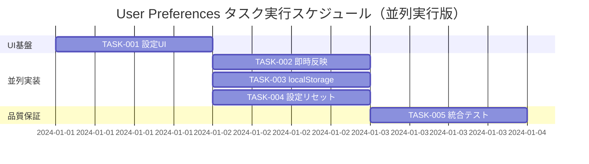

# User Preferences 実装タスク

## 概要

全タスク数: 5
推定作業時間: 5時間（並列実行により3時間短縮）
クリティカルパス: TASK-001 → (TASK-002 || TASK-003 || TASK-004) → TASK-005
並列実行可能: フェーズ2の3タスクを同時実行

## タスク一覧

### フェーズ1: UI基盤構築

#### TASK-001: 設定UIコンポーネントの作成

- [x] **タスク完了**
- **タスクタイプ**: TDD
- **要件リンク**: REQ-001, REQ-101, REQ-102
- **依存タスク**: なし
- **実装詳細**:
  - Theme選択用の`<select>`要素（light/dark）
  - Refresh Interval選択用の`<select>`要素（Off/5/10/30s）
  - Display Density選択用の`<select>`要素（compact/standard）
  - 各設定の現在値を表示するUI
- **UI/UX要件**:
  - [ ] 各設定の現在状態が視覚的に明確
  - [x] アクセシビリティ: aria-label属性設定
  - [ ] モバイル対応: タッチフレンドリーなUI
- **テスト要件**:
  - [x] 単体テスト: 各選択肢の表示確認
  - [x] 単体テスト: 初期値の表示確認
  - [x] コンポーネントテスト: 選択操作の動作確認
- **完了条件**:
  - [x] 3つの設定項目が表示される
  - [x] 各項目に適切なラベルが表示される
  - [x] デフォルト値が設定される

#### TASK-002: 即時DOM反映機能

- [ ] **タスク完了**
- **タスクタイプ**: TDD
- **要件リンク**: REQ-002, REQ-101, REQ-102, REQ-105, REQ-106
- **依存タスク**: TASK-001
- **並列実行**: TASK-003, TASK-004と並列実行可能
- **実装詳細**:
  - Theme変更時: `<html data-theme="light|dark">`属性更新
  - Display Density変更時: `<body>`に`density-compact|density-standard`クラス適用
  - Refresh Interval変更時: setInterval()の間隔変更
  - React useEffect hookによる副作用処理
- **UI/UX要件**:
  - [ ] テーマ切替の視覚的フィードバック（100ms以内）
  - [ ] 密度変更の即座反映
  - [ ] 自動更新間隔の即座適用
- **テスト要件**:
  - [ ] 単体テスト: Theme変更でdata-theme属性更新
  - [ ] 単体テスト: Density変更でbodyクラス更新
  - [ ] 単体テスト: Interval変更でタイマー再設定
  - [ ] 統合テスト: UI操作からDOM変更まで
- **完了条件**:
  - [ ] Theme変更が即座にDOM反映される
  - [ ] Density変更が即座にDOM反映される
  - [ ] Refresh Interval変更が即座に適用される

### フェーズ2: 並列実装（TASK-002, TASK-003, TASK-004）

#### TASK-003: localStorage永続化機能

- [ ] **タスク完了**
- **タスクタイプ**: TDD
- **要件リンク**: REQ-003, REQ-004, REQ-201, REQ-202
- **依存タスク**: TASK-001
- **並列実行**: TASK-002, TASK-004と並列実行可能
- **実装詳細**:
  - 設定変更時のlocalStorage自動保存
  - ページ読み込み時のlocalStorage自動復元
  - データ構造: `{theme, refreshInterval, density}`
  - エラーハンドリング: アクセス拒否、データ破損対応
- **データ構造**:
  ```javascript
  // localStorage key: 'userPreferences'
  {
    "theme": "light" | "dark",
    "refreshInterval": "Off" | "5" | "10" | "30",
    "density": "compact" | "standard"
  }
  ```
- **エラーハンドリング**:
  - [ ] localStorage無効時: メモリ上でのみ保持
  - [ ] データ破損時: デフォルト値適用
  - [ ] 不正値時: 該当項目のみデフォルト値適用
- **テスト要件**:
  - [ ] 単体テスト: 設定保存機能
  - [ ] 単体テスト: 設定復元機能
  - [ ] 単体テスト: エラー処理（localStorage無効）
  - [ ] 単体テスト: エラー処理（データ破損）
  - [ ] 統合テスト: 保存→リロード→復元フロー
- **完了条件**:
  - [ ] 設定変更が自動保存される
  - [ ] ページリロード後に設定が復元される
  - [ ] エラー時にも基本機能が動作する

#### TASK-004: 設定リセット機能

- [ ] **タスク完了**
- **タスクタイプ**: TDD
- **要件リンク**: REQ-005, REQ-107, REQ-108
- **依存タスク**: TASK-001
- **並列実行**: TASK-002, TASK-003と並列実行可能
- **実装詳細**:
  - 「Reset to Default」ボタンの追加
  - クリック時の確認ダイアログ表示
  - OK選択時: 全設定をデフォルト値に戻す
  - OK選択時: localStorageクリア
  - Cancel選択時: 設定保持
- **デフォルト値**:
  - Theme: "light"
  - Refresh Interval: "Off"
  - Display Density: "standard"
- **UI/UX要件**:
  - [ ] 確認ダイアログ: 誤操作防止
  - [ ] リセット後の視覚的フィードバック
  - [ ] アクセシビリティ: ダイアログのフォーカス管理
- **テスト要件**:
  - [ ] 単体テスト: Resetボタンクリック→確認ダイアログ表示
  - [ ] 単体テスト: OK選択→デフォルト値適用
  - [ ] 単体テスト: Cancel選択→設定保持
  - [ ] 単体テスト: localStorage正常クリア
  - [ ] E2Eテスト: Reset完全フロー
- **完了条件**:
  - [ ] Resetボタンが表示される
  - [ ] 確認ダイアログが機能する
  - [ ] デフォルト値への復元が動作する
  - [ ] localStorageが適切にクリアされる

### フェーズ3: 品質保証・統合

#### TASK-005: 統合テスト・品質確認

- [ ] **タスク完了**
- **タスクタイプ**: TDD
- **要件リンク**: 全要件
- **依存タスク**: TASK-002, TASK-003, TASK-004（全て完了後）
- **実装詳細**:
  - 全機能の統合動作確認
  - パフォーマンス要件の検証（100ms以内反映）
  - エッジケースの網羅的テスト
  - ブラウザ互換性確認
- **パフォーマンス要件**:
  - [ ] 設定変更の UI 反映: 100ms以内
  - [ ] localStorage 操作: 50ms以内
  - [ ] 初期読み込み時の設定復元: 200ms以内
- **エッジケーステスト**:
  - [ ] localStorage容量制限
  - [ ] 高速連続変更（100ms以内）
  - [ ] 複数タブ同時変更
  - [ ] ページリロード中の変更
- **テスト要件**:
  - [ ] E2Eテスト: 全フィーチャーのユーザーフロー
  - [ ] パフォーマンステスト: 応答時間計測
  - [ ] アクセシビリティテスト: スクリーンリーダー対応
  - [ ] ブラウザテスト: Chrome, Firefox, Safari
- **受入基準**:
  - [ ] 要件定義書の全受入基準を満たす
  - [ ] テストカバレッジ90%以上
  - [ ] パフォーマンス要件を満たす
  - [ ] エラー処理が適切に動作する
- **完了条件**:
  - [ ] 全てのテストがパスする
  - [ ] 要件定義の受入基準を満たす
  - [ ] ドキュメントが更新される

## 実行順序



## TDDプロセス詳細

各TDDタスクは以下のサイクルで実装:

### Red → Green → Refactor サイクル

1. **tdd-requirements.md** - 詳細要件定義
2. **tdd-testcases.md** - テストケース作成
3. **tdd-red.md** - テスト実装（失敗）
4. **tdd-green.md** - 最小実装
5. **tdd-refactor.md** - リファクタリング
6. **tdd-verify-complete.md** - 品質確認

### 実行コマンド例

```bash
# タスク開始
claude -p "/tdd-red"
# → ESC → "TASK-001 設定UIの失敗テストを生成" を追加入力

claude -p "/tdd-green"
# → ESC → "TASK-001を最小変更でGreen化" を追加入力

claude -p "/tdd-refactor"
# → ESC → "TASK-001の命名/重複/構成を整理" を追加入力

# テスト実行
docker compose exec frontend sh -lc "npm test -- --run"
```

## 技術スタック

- **Frontend**: React 18, Hooks
- **Testing**: Vitest, React Testing Library
- **Storage**: localStorage API
- **DOM**: data-theme属性, CSS classes
- **Build**: Vite

## 実行後の確認

- 更新ファイル: `docs/tasks/user-preferences-tasks.md`
- 全5タスク、推定5時間（並列実行により3時間短縮）
- 実行方式: TASK-001 → (TASK-002 || TASK-003 || TASK-004) → TASK-005
- 次ステップ: TASK-001完了後、フェーズ2の3タスクを同時開始推奨