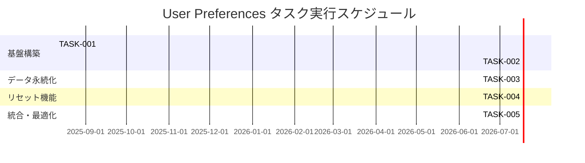

# User Preferences 実装タスク

## 概要

全タスク数: 5
推定作業時間: 8時間
クリティカルパス: TASK-001 → TASK-002 → TASK-003 → TASK-004 → TASK-005

## タスク一覧

### フェーズ1: 基盤構築（設定UI）

#### TASK-001: 基本設定UIの実装

- [ ] **タスク完了**
- **タスクタイプ**: TDD
- **要件リンク**: REQ-001, REQ-101, REQ-102, REQ-103, REQ-104, REQ-105, REQ-106
- **依存タスク**: なし
- **実装詳細**:
  - Theme選択（light/dark）のselect要素
  - Refresh Interval選択（Off/5s/10s/30s）のselect要素
  - Display Density選択（compact/standard）のselect要素
  - 各selectにaria-label属性を設定
  - デフォルト値設定（light/Off/standard）
- **テスト要件**:
  - [ ] コンポーネントテスト: 3つのselect要素が表示される
  - [ ] コンポーネントテスト: 各selectに正しい選択肢とデフォルト値が設定
  - [ ] コンポーネントテスト: アクセシビリティ属性の検証
  - [ ] コンポーネントテスト: onChange イベントの動作確認
- **UI/UX要件**:
  - [ ] アクセシビリティ: aria-label属性でスクリーンリーダー対応
  - [ ] レスポンシブ: モバイル端末での適切な表示
- **完了条件**:
  - [ ] 3つの設定選択UIが正しく表示される
  - [ ] 各選択肢とデフォルト値が仕様通り設定される
  - [ ] 全テストがパスする

#### TASK-002: 即時反映機能の実装

- [ ] **タスク完了**
- **タスクタイプ**: TDD
- **要件リンク**: REQ-001, REQ-101, REQ-103, REQ-105
- **依存タスク**: TASK-001
- **実装詳細**:
  - Theme変更時に `<html data-theme="light|dark">` 属性を即座に更新
  - Refresh Interval変更時に内部タイマー状態を更新
  - Display Density変更時に `<body>` に `density-compact|density-standard` クラスを適用
  - useEffect フックを使用した副作用処理
- **テスト要件**:
  - [ ] 統合テスト: Theme変更でHTML属性が更新される
  - [ ] 統合テスト: Density変更でbodyクラスが変更される
  - [ ] 単体テスト: 各設定変更時の副作用が正しく実行される
- **UI/UX要件**:
  - [ ] レスポンス時間: 設定変更から反映まで100ms以内
  - [ ] 視覚フィードバック: 変更が即座に画面に反映される
- **完了条件**:
  - [ ] Theme選択でdata-theme属性が即座に変更される
  - [ ] Density選択でbodyクラスが即座に変更される
  - [ ] Interval選択で内部状態が更新される
  - [ ] 全テストがパスする

### フェーズ2: データ永続化

#### TASK-003: localStorage保存・読込機能の実装

- [ ] **タスク完了**
- **タスクタイプ**: TDD
- **要件リンク**: REQ-001
- **依存タスク**: TASK-002
- **実装詳細**:
  - 各設定変更時にlocalStorageに保存
  - コンポーネント初期化時にlocalStorageから設定を読込
  - JSONフォーマットでの設定データ管理
  - localStorageキー: `userPreferences.theme`, `userPreferences.refreshInterval`, `userPreferences.density`
- **テスト要件**:
  - [ ] 単体テスト: 設定変更時のlocalStorage保存機能
  - [ ] 単体テスト: コンポーネント初期化時の設定読込機能
  - [ ] 統合テスト: ページリロード後の設定復元
  - [ ] エラーハンドリング: localStorage無効時の処理
- **エラーハンドリング**:
  - [ ] localStorage が無効/利用不可能な場合の処理
  - [ ] 不正なデータ形式の場合のフォールバック
- **完了条件**:
  - [ ] 設定変更がlocalStorageに保存される
  - [ ] ページ再読込で設定が復元される
  - [ ] 容量制限（1KB以内）を満たす
  - [ ] 全テストがパスする

### フェーズ3: リセット機能

#### TASK-004: リセット機能の実装

- [ ] **タスク完了**
- **タスクタイプ**: TDD
- **要件リンク**: REQ-001
- **依存タスク**: TASK-003
- **実装詳細**:
  - 「Reset to Default」ボタンの追加
  - confirm()ダイアログでの確認機能
  - 全設定をデフォルト値に復元
  - localStorageのクリア処理
  - DOM属性・クラスの初期化
- **テスト要件**:
  - [ ] コンポーネントテスト: リセットボタンの表示
  - [ ] 単体テスト: confirm()ダイアログの表示
  - [ ] 統合テスト: リセット後の全設定がデフォルト値に戻る
  - [ ] 統合テスト: localStorage クリア機能
  - [ ] 統合テスト: DOM属性・クラスの初期化
- **UI/UX要件**:
  - [ ] 確認ダイアログ: ユーザーの誤操作防止
  - [ ] 視覚フィードバック: リセット完了の即座反映
  - [ ] アクセシビリティ: ボタンのfocus状態対応
- **完了条件**:
  - [ ] リセットボタンが表示される
  - [ ] 確認ダイアログが機能する
  - [ ] 全設定がデフォルト値に戻る
  - [ ] localStorageがクリアされる
  - [ ] 全テストがパスする

### フェーズ4: 統合・最適化

#### TASK-005: 統合テスト・最適化

- [ ] **タスク完了**
- **タスクタイプ**: TDD
- **要件リンク**: 全要件
- **依存タスク**: TASK-004
- **実装詳細**:
  - E2Eテストシナリオの実装
  - パフォーマンス最適化
  - ブラウザ互換性確認
  - CSS スタイルの調整
- **テスト要件**:
  - [ ] E2Eテスト: 完全なユーザーフロー（設定変更→保存→リロード→復元→リセット）
  - [ ] パフォーマンステスト: レスポンス時間測定
  - [ ] ブラウザテスト: Chrome/Firefox/Safari対応確認
  - [ ] アクセシビリティテスト: ARIA属性・キーボード操作
- **UI/UX要件**:
  - [ ] モバイル対応: レスポンシブデザイン確認
  - [ ] 視覚デザイン: 既存UIとの統一性
  - [ ] ユーザビリティ: 3クリック以内での設定変更
- **完了条件**:
  - [ ] 全ユーザーシナリオが正常動作する
  - [ ] パフォーマンス要件（100ms以内）を満たす
  - [ ] 主要ブラウザで正常動作する
  - [ ] 全テストがパスする

## 実行順序



## サブタスクテンプレート

### TDDタスクの場合

各タスクは以下のTDDプロセスで実装:

1. `tdd-requirements.md` - 詳細要件定義
2. `tdd-testcases.md` - テストケース作成
3. `tdd-red.md` - テスト実装（失敗）
4. `tdd-green.md` - 最小実装
5. `tdd-refactor.md` - リファクタリング
6. `tdd-verify-complete.md` - 品質確認

### DIRECTタスクの場合

各タスクは以下のDIRECTプロセスで実装:

1. `direct-setup.md` - 直接実装・設定
2. `direct-verify.md` - 動作確認・品質確認

## 実行コマンド例

### TDD開発サイクル

```bash
# TASK-001: 基本設定UI
claude -p "/tdd-red"    # → "TASK-001の失敗テストを作成"
claude -p "/tdd-green"  # → "TASK-001を最小実装でGreen化"
claude -p "/tdd-refactor" # → "TASK-001のリファクタリング"

# TASK-002: 即時反映機能
claude -p "/tdd-red"    # → "TASK-002の失敗テストを作成"
claude -p "/tdd-green"  # → "TASK-002を最小実装でGreen化"
claude -p "/tdd-refactor" # → "TASK-002のリファクタリング"

# 以下同様にTASK-003〜005を実施
```

### テスト実行

```bash
# フロントエンドテスト実行
docker compose exec frontend sh -lc "npm test -- --run"

# リント・タイプチェック
docker compose exec frontend sh -lc "npm run lint"
```

## Cursor レビュー依頼テンプレート

tsumiki のスラッシュコマンド実行後に、以下を Cursor にコピペしてください。

### /tdd-green 用

```text
TASK-００１ に対する /tdd-green の成果物をレビューしてください。

対象:
- 機能: ユーザープリファレンス UI の最小実装（Theme / Refresh Interval / Display Density）
- 変更ファイル（例）:
  - frontend/src/UserPreferences.jsx
  - frontend/src/UserPreferences.test.jsx

確認観点:
- 要件の満たし方（REQ-001, REQ-101, REQ-102）
- テストの妥当性と網羅性（Red → Green が成立しているか）
- 命名・責務分割・可読性（過剰な実装がないか）

補足:
- ローカルでテストはグリーンです（npm test）。
```

### /tdd-refactor 用

```text
TASK-００１ に対する /tdd-refactor の成果物をレビューしてください。

対象:
- 重複排除・命名改善・責務整理のリファクタリング
- 変更ファイル（例）:
  - frontend/src/UserPreferences.jsx
  - frontend/src/UserPreferences.test.jsx

確認観点:
- 動作は維持されているか（テストはグリーン）
- 重複の削減・見通しの良さ・拡張性
- コンポーネント分割と依存方向が適切か

補足:
- 必要に応じて重複検出ツール（jscpd など）の観点もお願いします。
```

### 一括レビュー依頼テンプレート（TASK-001〜005）

以下をそのままコピーして、対象タスク番号だけ差し替えて使えます。

#### TASK-001 基本設定UI
- /tdd-green
```text
TASK-001 に対する /tdd-green の成果物をレビューしてください。

対象:
- UI: Theme/Refresh Interval/Display Density のselect要素（デフォルト light/Off/standard）
- 変更ファイル（例）:
  - frontend/src/UserPreferences.jsx
  - frontend/src/UserPreferences.test.jsx

確認観点:
- 3つのselect表示、選択肢と初期値、aria-label の有無
- Red→Green 成立（テスト妥当性）
- 命名・責務分割・過不足のない最小実装
```

- /tdd-refactor
```text
TASK-001 に対する /tdd-refactor の成果物をレビューしてください。

対象:
- 重複排除（App側とのUI重複がないこと）
- 共通化・定数の外出し、アクセシビリティ改善

確認観点:
- 動作維持（全テストGreen）
- 見通し・拡張性・依存方向の適切さ
```

#### TASK-002 即時反映機能
- /tdd-green
```text
TASK-002 に対する /tdd-green の成果物をレビューしてください。

対象:
- 即時反映: `<html data-theme>`, `<body class="density-*>">`, タイマー間隔の更新
- 変更ファイル（例）:
  - frontend/src/UserPreferences.jsx（useEffect等）
  - frontend/src/App.jsx（必要なら）

確認観点:
- 100ms以内の反映、視覚的フィードバック
- テスト（統合/単体）の妥当性
```

- /tdd-refactor
```text
TASK-002 に対する /tdd-refactor の成果物をレビューしてください。

対象:
- DOM更新ロジックの分離（utils/dom など）
- ハンドラのメモ化・責務整理

確認観点:
- 動作維持、重複削減、将来のhook化/最適化しやすさ
```

#### TASK-003 localStorage 永続化
- /tdd-green
```text
TASK-003 に対する /tdd-green の成果物をレビューしてください。

対象:
- 保存/復元: localStorage（key: userPreferences.* または userPreferences）
- 変更ファイル（例）:
  - frontend/src/UserPreferences.jsx
  - frontend/src/__tests__/…（保存/復元/エラー系）

確認観点:
- ページ再読込での復元、1KB以内、エラー時フォールバック
```

- /tdd-refactor
```text
TASK-003 に対する /tdd-refactor の成果物をレビューしてください。

対象:
- 永続化ロジックの分離（hooks: useLocalStorage / useUserPreferences）
- バリデーション/エラーハンドリングの共通化

確認観点:
- 動作維持、APIの明確さ、テスト容易性
```

#### TASK-004 リセット機能
- /tdd-green
```text
TASK-004 に対する /tdd-green の成果物をレビューしてください。

対象:
- Resetボタン、confirm()、既定値復元、localStorageクリア、DOM初期化

確認観点:
- シナリオ一貫性、UI/UX（確認ダイアログ、フィードバック）
```

- /tdd-refactor
```text
TASK-004 に対する /tdd-refactor の成果物をレビューしてください。

対象:
- リセット処理の関数分離、再利用性、テスト容易性

確認観点:
- 動作維持、責務分離、エッジケースの扱い
```

#### TASK-005 統合テスト・最適化
- /tdd-green
```text
TASK-005 に対する /tdd-green の成果物をレビューしてください。

対象:
- E2Eフロー（変更→保存→リロード→復元→リセット）

確認観点:
- 主要ブラウザ/パフォーマンス/アクセシビリティ要件
```

- /tdd-refactor
```text
TASK-005 に対する /tdd-refactor の成果物をレビューしてください。

対象:
- ボトルネック改善（debounce, バッチDOM更新 等）
- テストの重複/ムダの削減

確認観点:
- 動作維持、パフォーマンス目標、テストメンテ性
```